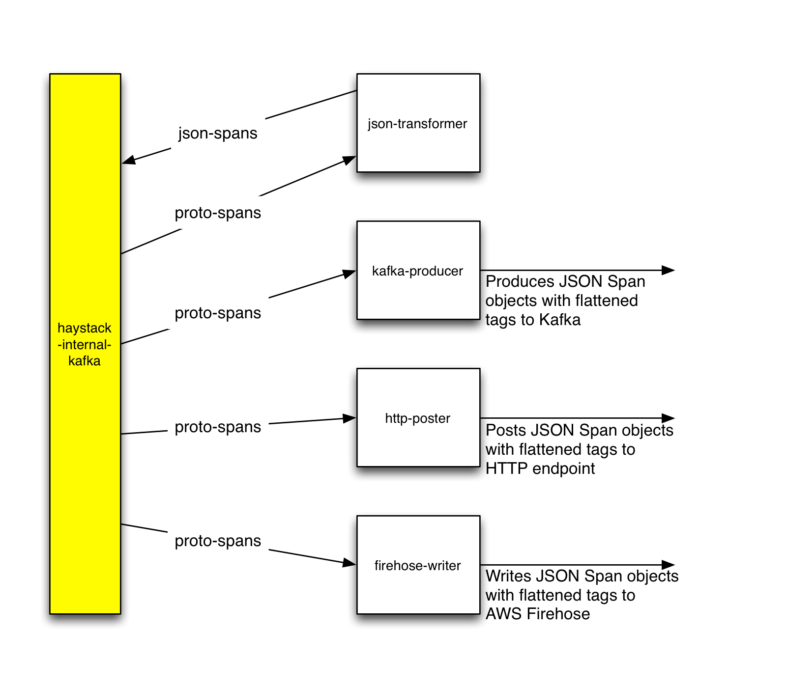

# haystack-pipes

Packages to send or "pipe" Haystack data to external sinks like AWS Firehose or another Kafka queue.



The `haystack-pipes` unit delivers a human-friendly version of Haystack messages to zero or more "durable" locations for more permanent storage.
Current plug-in implementations are:

1. [kafka-producer](https://github.com/ExpediaDotCom/haystack-pipes/tree/master/kafka-producer): 
This package uses Kafka Streams to read the protobuf records from Kafka, transform them to JSON, and write them to another Kafka, 
typically a different Kafka installation than the one from which the protobuf records were read. 
The `kafka-producer` package uses the [Kafka Producer API](https://kafka.apache.org/0110/javadoc/index.html?org/apache/kafka/clients/producer/Producer.html) 
to write to Kafka.

2. [firehose-writer](https://github.com/ExpediaDotCom/haystack-pipes/tree/master/firehose-writer): 
This package uses Kafka Streams to read the protobuf records from Kafka, transform them to JSON, and write them to 
the [Amazon Kinesis Data Firehose](https://aws.amazon.com/kinesis/data-firehose/), an AWS service that facilitates 
loading streaming data into AWS. 
Note that the Kinesis Firehose [PutRecordBatch API](http://docs.aws.amazon.com/firehose/latest/APIReference/API_PutRecordBatch.html) 
accepts up to 500 records, with a maximum size of 4 MB for each put request. `firehose-writer` will batch the records appropriately. 
Kinesis Firehose can be configured to deliver the data to other AWS services that facilitate data analysis, 
such as [Amazon S3](https://aws.amazon.com/s3/), [Amazon Redshift](https://aws.amazon.com/redshift/), 
and [Amazon Elasticsearch Service](https://aws.amazon.com/elasticsearch-service/).

3. [json-transformer](https://github.com/ExpediaDotCom/haystack-pipes/tree/master/json-transformer): 
This package uses [Kafka Streams](https://kafka.apache.org/documentation/streams/) to read the protobuf records from Kafka, transform
them to JSON, and write them to another topic in Kafka.

4. [http-poster](https://github.com/ExpediaDotCom/haystack-pipes/tree/master/http-poster): 
This package uses Kafka Streams to read the protobuf records from Kafka, transform them to JSON, and send them to another service, via an
[HTTP POST](https://en.wikipedia.org/wiki/POST_(HTTP)) request.

In all of the cases above, "transform to JSON" implies "tag flattening": the [OpenTracing API](https://github.com/opentracing/specification/blob/master/semantic_conventions.md) specifies tags in a 
somewhat unfriendly format. For example, the following open tracing tags:

```bash
"tags":[{"key":"strKey","vStr":"tagValue"},
        {"key":"longKey","vLong":"987654321"},
        {"key":"doubleKey","vDouble":9876.54321},
        {"key":"boolKey","vBool":true},
        {"key":"bytesKey","vBytes":"AAEC/f7/"}]
```

will be converted to

```bash
"tags":{"strKey":"tagValue",
        "longKey":987654321,
        "doubleKey":9876.54321,
        "boolKey":true,
        "bytesKey":"AAEC/f7/"}}
```

by code in the Pipes [commons](https://github.com/ExpediaDotCom/haystack-pipes/tree/master/commons) module. The commons
module also contains other shared code that:

* Reads Kafka configurations
* Facilitates creating and starting Kafka Streams
* Serializes Spans
* Provides shared constants to unit tests
* Changes environment variables to lower case for consumption by [cfg4j](http://www.cfg4j.org/) (haystack-pipes uses cfg4j to read configuration files)
* Starts polling for the Counters and Timers provided by [haystack-metrics](https://github.com/ExpediaDotCom/haystack-metrics)

## Building

### Cloning
#### From scratch
Since this repo contains `haystack-idl` as a submodule, a recursive clone of the
[haystack-pipes package](https://github.com/ExpediaDotCom/haystack-pipes) is required:

```bash
git clone --recursive git@github.com:ExpediaDotCom/haystack-pipes.git .
```

#### From existing directory
If you have already cloned the the [haystack-pipes package](https://github.com/ExpediaDotCom/haystack-pipes) (perhaps
with an IDE that did not clone recursively as the command above instructs), or if you want to pick up a newer version of
the [haystack-idl package](https://github.com/ExpediaDotCom/haystack-idl), run the following from your haystack-pipes
directory:

```bash
git submodule update --init --recursive
```

### Prerequisites: 

* Java 1.8
* Maven 3.3.9 or higher
* Docker 1.13 or higher

### Build

#### Full build
For a full build, including unit tests, run (from the directory to where you cloned haystack-pipes):

``` bash
make all
```